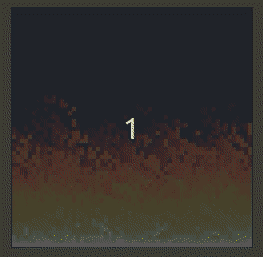

<h1 align="center"> Fire Doom </h1>

<p align="center">🔥 Recriando o efeito de fogo do jogo Doom</p>

<h1 align="center">
  
  
  
  
</h1>

<h1 align="center">
  
</h1>

<h4 align="center"> 
	🚧  Fire doom | Concluído 🚀 🚧
</h4>

## 💻 Sobre o projeto

Projeto desenvolvido em cima de um video feito pelo Filipe Deshamps no YouTube. Que tinha como finalidade criar um algoritmo para
criar a animação de fogo do jogo Doom, a animação em si ficou no estilo pixelart muito massa!

### 🌀 Como executar o programa

```bash
  # Clone este repositório
$ git clone <https://github.com/Kaique-Dirceu/doom-fire-effect>

# Acesse a pasta do projeto 
$ doom-fire-effect

# Abra como o seu browser o arquivo:
$ index.html

```


## 🛠 Linguagens 

As seguintes linguagens foram usadas na construção do projeto:

-  HTML
-  CSS
-  JavaScript


### Autor
---
<a>
 
<b>Kaique Dirceu 🚀</b>

Feito com ❤️ por Kaique Dirceu 👋🏽 Entre em contato!

[](https://twitter.com/Kaique_dirceu)  [](https://www.linkedin.com/in/kaique-dirceu/)  [](mailto:dirceukaique@gmail.com)
